# Intro

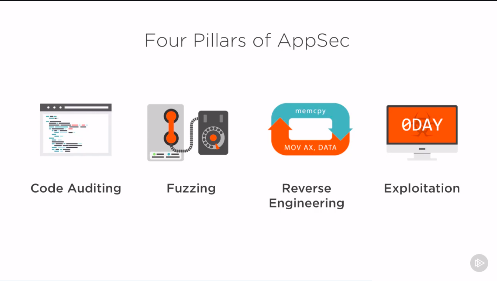

CTF - capture the flag

## Security IQ

- evaluate effectiveness of training programm

### Trics

- Isolated Heap
  - [Isolated Heap Flash player](https://googleprojectzero.blogspot.com/2016/03/life-after-isolated-heap.html)
  - [Isolated Heap IE](https://securityintelligence.com/understanding-ies-new-exploit-mitigations-the-memory-protector-and-the-isolated-heap/)
- Delayed Free
  - [Delayed free IE](https://www.trendmicro.com/en_us/research/14/g/mitigating-uaf-exploits-with-delay-free-for-internet-explorer.html)

## Security Development Lifecycle (SDLs)

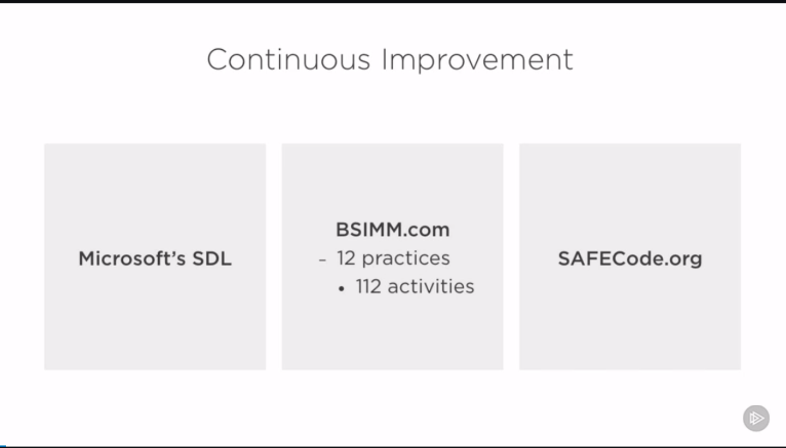

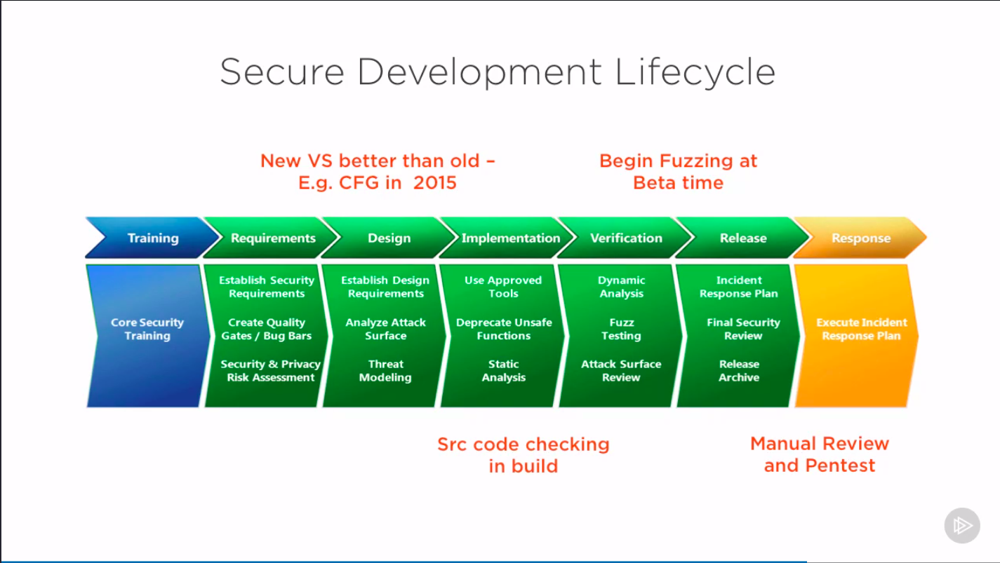

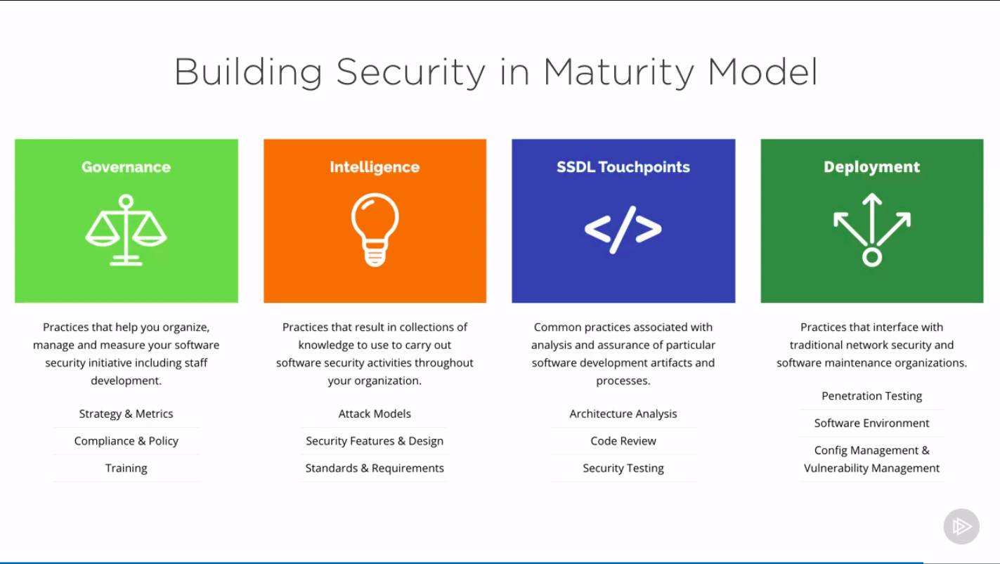

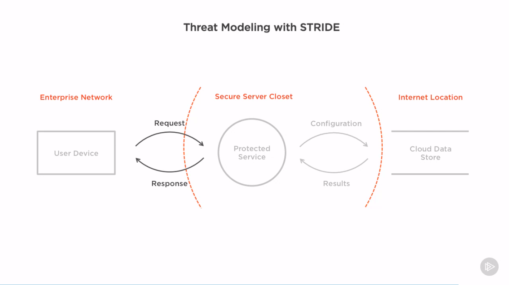

## Tools for Threadmodelling

- Microsoft Threat Modeling Tool
  - [https://docs.microsoft.com/en-us/azure/security/develop/threat-modeling-tool]
  - Now in Azure

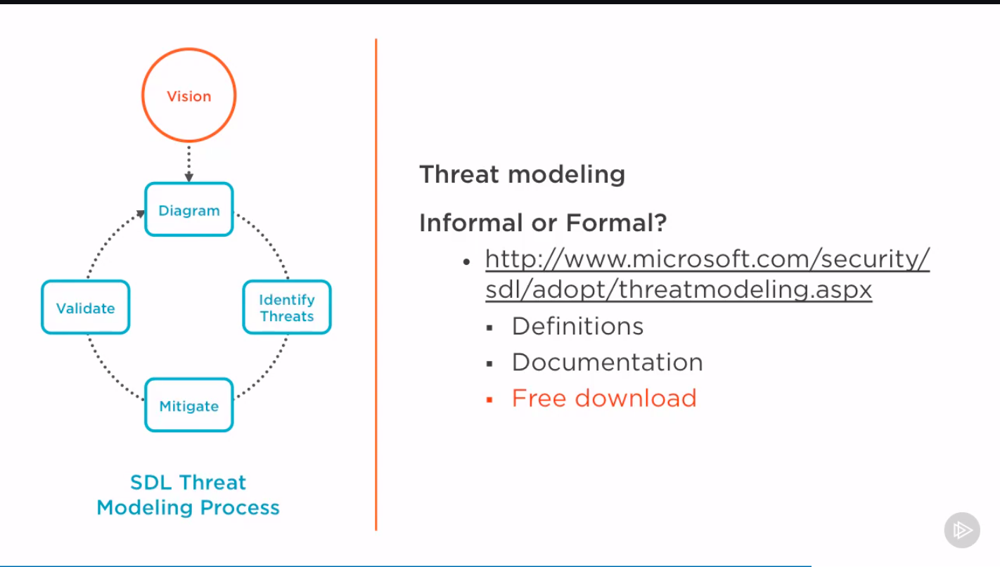

### Example

Not to give additional info about login/pass, just make auth error.
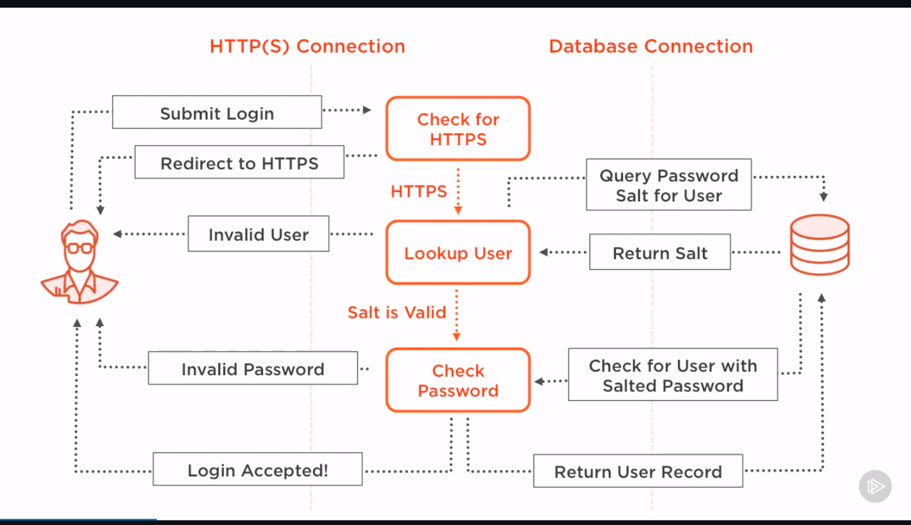

## Risk analysis

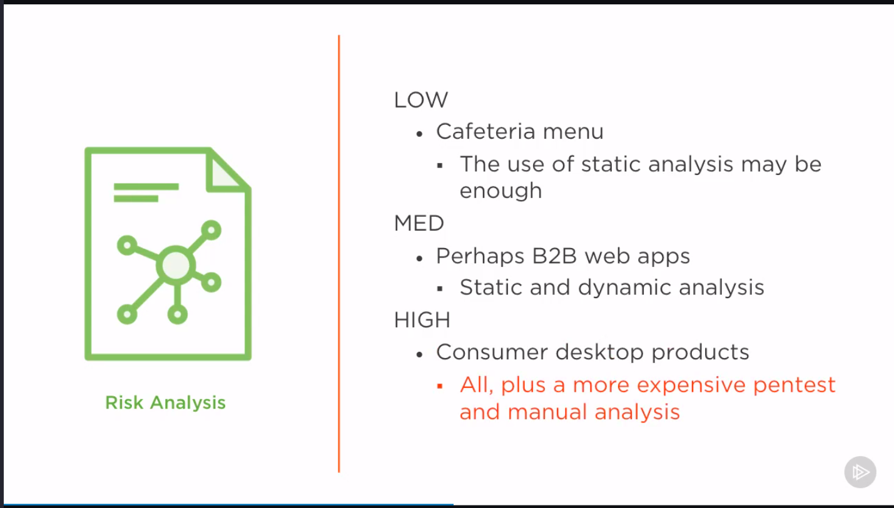

## Examples of dangerous input

### Bad example of buffer overflow

```cpp
char buf[100];
int x = atoi(argv[1]); // bug - we cannot trust user input
if ( x < 100 ){
    strncpy(buf, argv[2], x)
}
```

fix-up:

```cpp
char buf[100];
int x = strlen(argv[2]); // fix - test if for ourself
if ( x < 100 ){
    strncpy(buf, argv[2], x)
}
```

### Cross-site Script Example

```py3
url = params.get('details_url', None)
if url:
    # bug -- do not directly interpret user input as HTML
    markup - markup.replace(
        url, u'<a href = "{0}">{0}</a>'.format(url)
        )
```

```py3
url = params.get('details_url', None)
if url:
    # fix == string will not be interpreted as script
    url = escape(url)
    markup - markup.replace(
        url, u'<a href = "{0}">{0}</a>'.format(url)
        )
```

## Security Bugs

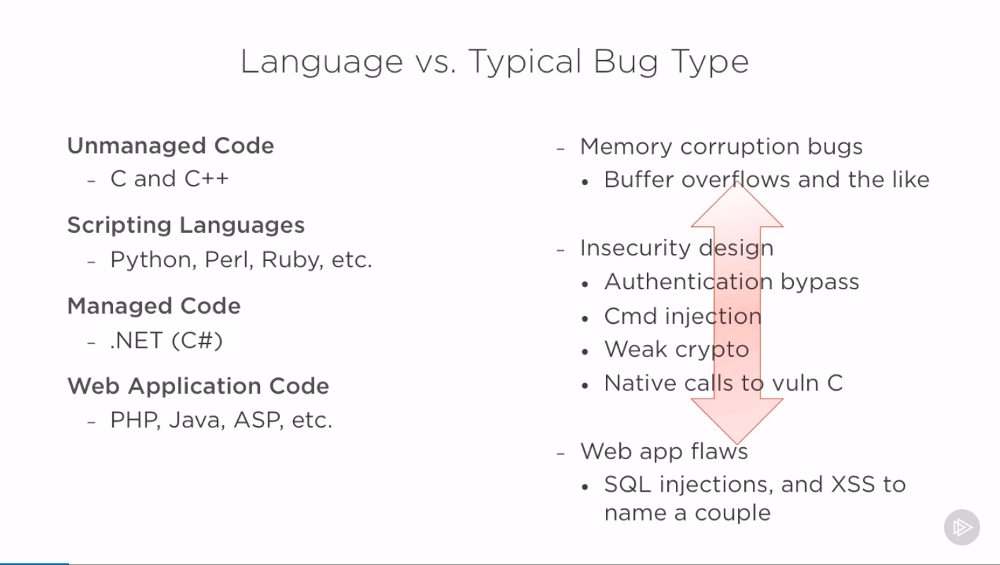

### Start with attack surface

- Point at which untrusted data enters and is processed
  - E.g. Code that processes the network packet for network server

### Dark Corners

- Geater chance of bugs, compared to well tested
- Cold path
  - E.g. A packet that is never sent by a real client, but code exist to handle it

### Complex components

- Devs rely on, but often didn't write/fully understand
  - Low-level/Back-end compononts
  - Allocators
  - Garbage collection
  - JIT

## Find the Bugs

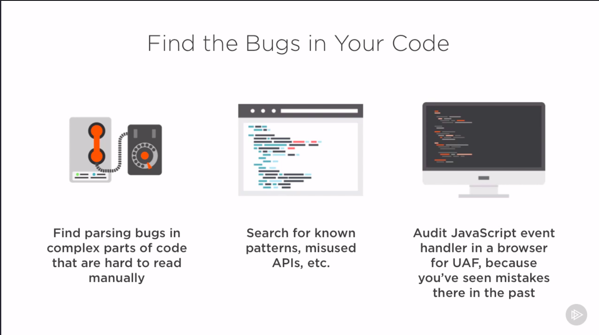

# Using Static Analysis

- Development tools
  - Visual Studio Code from 2015 control guard
  -CppCheck
- Security tools
  - Fortify
  - Coverity

## Pros of Static Analysis Tools

- Runs across all code
- Extensible to find new bugs

## Cons of Static Analysis Tools

- False Positives
- False Negatives

## Static analysis cycle

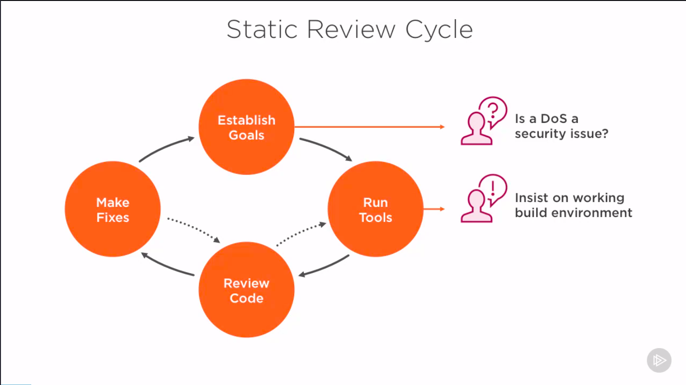

## Static analysis process

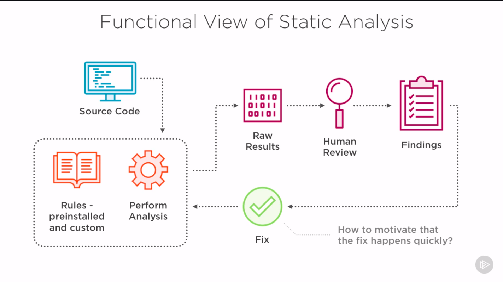

## Static analysis reports


Prioritizing reports is important. Particelarly if just starting with static for the first time

SA Tools do not have a strong reputation for being useful to higly complex projects

# Learning by case study

## Manual analysis process


### Technics

- Top down
- Bottom up

- Line-by-line
- Desk-checking
- Multiple Passes

